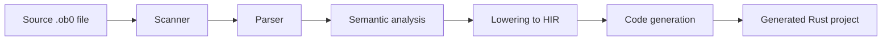

# Compiler Pipeline and Code Generation Notes

This document explains how an Oberon0 source file moves through the compiler and why the code generator needs internal analysis helpers.

## Overview

The compiler pipeline is intentionally staged:

Each stage has a different responsibility:

- Scanner: turns text into tokens.
- Parser: builds the AST from those tokens.
- Semantic analysis: validates declarations, scope, types, and built-ins.
- Lowering: converts the AST into the HIR used by code generation.
- Code generation: emits Rust source and runtime helpers.

## Why the pipeline is split

The compiler needs to separate concerns:

- parsing answers "Is this syntax valid?"
- semantic analysis answers "Is this program meaningful?"
- lowering answers "How should this be represented for code generation?"
- code generation answers "How should this be emitted as Rust?"

This separation makes the compiler easier to reason about and keeps each stage focused on one kind of task.

## The HIR and why it exists

The HIR is the intermediate representation used by the code generator. It is more structured than the raw AST and carries the information that the Rust emitter needs.

In practice, the HIR is where the compiler records:

- resolved identifiers,
- procedure declarations,
- local variables,
- expressions and statements in a normalized form,
- the semantic information that code generation depends on.

This is important because the generator does not work directly from the original source text. It works from the lowered representation that already has names, scopes, and declarations resolved.

## How Oberon0 source influences code generation

Code generation is not just a literal translation of source text. It also makes implementation decisions based on the structure of the program.

For example, the generator inspects the lowered program to decide whether runtime state tracking is required. This is useful when the generated Rust needs to preserve values for:

- module variables,
- procedure-local variables,
- state snapshots for debugging or inspection.

The decision is not made by the language itself. Instead, the compiler analyzes the lowered statements and expressions and decides whether emitting state-tracking machinery is necessary.

## Examples of compiler-internal decisions

### 1. Whether runtime state is needed

The generator checks whether a module or procedure contains constructs that require state tracking. This can happen when the generated program contains:

- assignments to variables,
- procedure calls that may involve stateful procedure locals,
- nested control flow that references variables in expressions.

In those cases, the generator may emit runtime state maps and related helpers.

### 2. Whether a parameter must be passed mutably

When a procedure parameter is assigned inside the procedure body, the generator may need to model it as a mutable binding. This is not a language-level concept exposed directly to the user; it is a code-generation choice made after lowering.

The relevant signal is the structure of the procedure body after semantic analysis and lowering.

### 3. Whether I/O helpers are required

Built-in I/O calls such as `WriteInt`, `WriteReal`, `WriteLongReal`, `ReadInt`, `ReadReal`, `ReadLongReal`, and `EOF` may require the generator to emit supporting Rust helpers. The generator inspects the lowered program to determine which helpers are needed.

## Why this matters for testing

These decisions are internal compiler behavior, not user-visible Oberon0 language features. That means they are best covered by tests that exercise the compiler pipeline end to end.

The most useful regression tests are:

- golden tests over real Oberon0 source,
- generated Rust output comparisons where appropriate,
- tests that confirm the compiler emits the intended runtime helpers for representative programs.

This is preferable to testing the implementation details in isolation unless the behavior is purely internal and cannot be observed through generated output.

## Practical implication

When reading the code generation code, it helps to remember this mental model:

- a user writes Oberon0 source,
- the compiler analyzes it,
- the generator makes translation decisions from the lowered structure,
- those decisions produce the final Rust project.

The helpers in the generator are therefore not “magic” language features. They are part of the compiler’s translation strategy.

## Summary

The compiler pipeline is a staged translation process:

1. scanner,
2. parser,
3. semantic analysis,
4. lowering to HIR,
5. code generation.

The code generator relies on internal analysis helpers to decide how to emit Rust. Those helpers are important because they bridge the gap between the abstract program representation and the concrete generated runtime.
