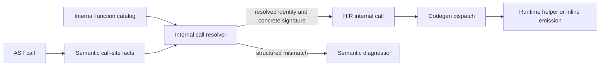

# Internal Function Catalog and Dispatch Design

Status: In progress for issue #75. Catalog/matcher and semantic integration phases are implemented.

This document defines the architecture for centralizing the language-level definition, resolution, validation, lowering, and backend dispatch of internal functions. It supersedes the catalog and dispatch direction in `internal-builtin-modules-concept.md` while preserving that document's qualified `IO` and `MATH` language surface.

## Problem statement

Internal function handling is currently distributed across semantic analysis, symbol and type handling, lowering, HIR, code generation, and runtime-helper selection.

The current implementation has several sources of duplication:

1. Semantic analysis maps qualified names to a private builtin identifier.
2. Arity, call-context, and argument-type rules are checked in separate semantic paths.
3. Lowering resolves calls again and does not preserve the semantic builtin identity or concrete signature.
4. HIR represents calls as ordinary resolved names.
5. Code generation matches builtin names to select emission and runtime helpers.

Adding or changing an internal function therefore requires coordinated edits across compiler phases. This risks inconsistent validation, diagnostics, and generated behavior. The current fixed-arity helpers also cannot express optional or variadic parameters, parameter modes, shared type relationships, or result types derived from arguments.

## Goals

1. Make one catalog the authoritative definition of every internal function.
2. Give each internal function a stable identity independent of its source spelling.
3. Express fixed, optional, and variadic signatures through one generic model.
4. Express exact types, accepted type sets, type predicates, shared type variables, literal constraints, and `VAR` parameter requirements.
5. Resolve and validate a call once, producing either a typed resolved call or a structured diagnostic.
6. Preserve resolved identity and concrete parameter and result types through HIR.
7. Dispatch code generation by resolved identity without repeating signature matching.
8. Preserve the current qualified `IO` and `MATH` source and runtime behavior.
9. Make the process for adding an internal function explicit and testable.

## Non-goals

1. This design does not add new source-level internal functions.
2. It does not change import requirements or permit unqualified builtin calls.
3. It does not change `IO.EOF()` from its current `INTEGER` result.
4. It does not define external module or user-procedure overload resolution.
5. It does not embed backend-specific Rust source templates in the language-level catalog.
6. It does not require a public plugin or runtime registration API.

## Terminology

An **internal function** is a compiler-provided callable member of a predefined module. The term includes statement-only procedures such as `IO.WriteLn` and expression-only functions such as `MATH.FLT`.

A **descriptor** is the catalog entry containing language-level metadata for one internal function.

A **signature** is one accepted parameter sequence and result rule for a descriptor.

A **resolved internal call** is the successful result of matching source arguments against a descriptor signature. It contains the stable function identity and all concrete type and parameter-mode information required by later phases.

## Architectural boundary

The catalog owns language-level facts:

1. Qualified source name.
2. Allowed call context.
3. Accepted signatures.
4. Parameter cardinality, mode, and type constraints.
5. Result-type rules.
6. Stable backend dispatch identity.

Semantic analysis owns source-program facts:

1. Whether the predefined module was imported.
2. The call context at the source location.
3. Inferred argument types.
4. Whether an argument is a literal or assignable designator.

HIR owns the resolved outcome. Code generation consumes that outcome and owns backend emission and runtime-helper implementation. It must not reinterpret language-level signatures.



## Catalog model

Exact Rust names may be adjusted during implementation, but the ownership and information represented by this model are required.

### Stable identity

`InternalFunctionId` is a closed, copyable identifier with one value per internal function:

```rust
enum InternalFunctionId {
    IoWriteInt,
    IoWriteString,
    IoWriteLn,
    IoWriteReal,
    IoWriteLongReal,
    IoReadInt,
    IoReadReal,
    IoReadLongReal,
    IoEof,
    MathFlt,
    MathFloor,
}
```

The identifier is the cross-phase dispatch key. Source names are catalog metadata used for lookup and diagnostics, not later dispatch.

### Descriptor

Each `InternalFunctionDescriptor` contains:

1. `id: InternalFunctionId`.
2. `module_name: &'static str`.
3. `member_name: &'static str`.
4. `call_context: CallContext`.
5. `signatures: &'static [InternalSignature]`.

The qualified name is derived from the module and member fields. `CallContext` has the variants `StatementOnly`, `ExpressionOnly`, and `StatementOrExpression`.

A separate codegen target field is unnecessary while `InternalFunctionId` is itself the backend dispatch key. If multiple backends later need distinct mappings, each backend should own its mapping from `InternalFunctionId` rather than putting backend source details into the catalog.

### Signatures and parameters

An `InternalSignature` contains an ordered parameter specification and a result specification.

Each `ParameterSpec` contains:

1. A cardinality: `Required`, `Optional`, or `Variadic`.
2. A mode: `Value`, `Var`, or `Literal`.
3. A type constraint.

Cardinality rules are deliberately simple:

1. Required parameters precede optional parameters.
2. At most one variadic parameter is allowed.
3. A variadic parameter is last.
4. Optional and variadic parameters may be combined only when accepted arities remain unambiguous.

`ParameterMode::Var` requires an assignable designator and records reference semantics in the resolved parameter. `ParameterMode::Literal` requires an AST literal before type matching. This supports the current `IO.WriteString` restriction without making literal handling a type.

### Type constraints

`TypeConstraint` must represent at least:

1. `Exact(TypeRef)` for one exact type.
2. `OneOf(&'static [TypeRef])` for a finite accepted set.
3. `Predicate(TypePredicate)` for named families such as numeric or scalar types.
4. `TypeVariable(TypeVariableId, TypeConstraint)` to bind a concrete argument type and require later occurrences of the same variable to match it.

The constraint attached to a type variable limits which concrete type can initially bind it. Type variables are scoped to one signature match.

Named `TypePredicate` values, rather than arbitrary closures, keep descriptors static, comparable, printable in diagnostics, and exhaustively testable.

### Result specification

`ResultSpec` has these forms:

1. `None` for calls with no value.
2. `Exact(TypeRef)` for a fixed result type.
3. `TypeVariable(TypeVariableId)` for a result derived from a bound argument type.
4. `FromArgument { index, transform }` for a result derived through a small named type transform when identity is insufficient.

Named transforms are catalog-domain values with deterministic behavior and printable descriptions. Backend functions or semantic callbacks are not stored in descriptors.

### Resolved representation

Successful matching returns a `ResolvedInternalCall` containing:

1. `id: InternalFunctionId`.
2. The selected signature index or stable signature identity.
3. The concrete parameter list after optional and variadic expansion.
4. The resolved mode and concrete type for each supplied argument.
5. The concrete result type, if any.

The resolved representation contains no borrowed catalog data so it can be owned by semantic results and HIR.

## Catalog API

The catalog exposes narrow, generic operations:

1. `lookup(module, member) -> Option<&InternalFunctionDescriptor>`.
2. `module_exists(module) -> bool`.
3. `resolve_call(descriptor, call_site) -> Result<ResolvedInternalCall, InternalCallError>`.
4. Signature formatting for diagnostics and tests.

Compiler phases must not reproduce descriptor tables or match on source names to determine internal-function behavior.

The catalog should live in a dedicated module, separate from semantic analysis and code generation. It may use static descriptor slices or equivalent immutable data. Runtime mutation is not required.

## Resolution algorithm

Semantic analysis builds an `InternalCallSite` containing the call context and one fact record per argument. Each argument fact includes its inferred type, whether it is a literal, and whether it is a valid assignable designator.

Resolution proceeds as follows:

1. Validate that the call context is allowed by the descriptor.
2. Select signatures whose required, optional, and variadic cardinalities accept the supplied argument count.
3. Expand each candidate's parameters to the supplied arity.
4. Match argument modes from left to right.
5. Match type constraints while collecting type-variable bindings.
6. Resolve the result specification from the completed bindings and argument types.
7. Return the unique successful `ResolvedInternalCall`.

If no candidate succeeds, the resolver returns the most specific structured mismatch together with all accepted signatures. Mismatch precedence is:

1. Invalid call context.
2. Arity mismatch.
3. Parameter-mode mismatch.
4. Argument-type mismatch.
5. Ambiguous signature.

The initial catalog must not contain ambiguous signatures. Detecting ambiguity remains a resolver error so future catalog mistakes fail explicitly rather than depending on declaration order.

## Diagnostics

`InternalCallError` is a structured compiler-internal error translated to the existing user-facing semantic diagnostic system at the semantic boundary.

Required error data includes:

1. Qualified function name.
2. Actual call context.
3. Actual argument count and inferred argument types.
4. Failing one-based argument position for mode and type mismatches.
5. Expected mode or type constraint.
6. Formatted accepted signatures.

Required diagnostic categories are:

1. Unknown predefined module member.
2. Invalid call context.
3. Arity mismatch.
4. Parameter-mode mismatch.
5. Incompatible argument type.
6. Ambiguous internal signature.

An unimported `IO` or `MATH` module remains an ordinary undefined-symbol error before catalog call matching. A qualified call through a non-internal module remains on the external-call path.

Diagnostics should include accepted signatures and actual argument types, for example:

```text
MATH.FLOOR does not accept argument types (INTEGER); expected FLOOR(REAL | LONGREAL) -> INTEGER
```

Exact wording and existing diagnostic codes may be preserved where practical, but tests should assert structured categories and stable high-value text rather than incidental formatting.

The semantic diagnostic model should add dedicated variants and codes for internal-member, call-context, internal-arity, parameter-mode, internal-argument-type, and ambiguous-signature failures. Existing broad diagnostics such as generic arity, type mismatch, or invalid builtin argument do not carry enough structured information for this resolver. Existing codes may be retained where compatibility requires it, but resolver failures must otherwise translate one-to-one from `InternalCallErrorKind` rather than being collapsed into a generic diagnostic.

## Compiler pipeline integration

### Semantic analysis

Semantic analysis performs the only signature match. For every call it must:

1. Resolve the imported qualifier.
2. Look up the internal descriptor when the qualifier denotes a predefined module.
3. Infer argument facts.
4. Call the generic resolver.
5. Store the resolved call for lowering or attach it to the analyzed call representation.

The existing builtin-specific helpers for identity, arity, context, and return-type inference are removed after migration. Both statement and expression call paths use the same resolver.

### Semantic-to-lowering contract

Lowering must consume semantic resolution rather than resolve the source spelling again. Semantic analysis produces an analyzed AST in which each call carries its resolved target. The parser AST remains independent of semantic types; semantic analysis transforms or wraps its call nodes rather than mutating parser-owned nodes in place. Internal call targets contain the owned `ResolvedInternalCall`, while non-internal call targets preserve the information required by ordinary lowering.

This analyzed-AST attachment is preferred over a side table because the current AST has no stable node identity and lowering should receive one self-contained, typed input. It also makes a missing resolution structurally difficult to represent instead of relying on synchronized AST and map lifetimes.

The contract must satisfy these invariants:

1. Every semantically valid internal call has exactly one `ResolvedInternalCall` available to lowering.
2. Lowering treats a missing result as an internal compiler invariant violation.
3. Lowering does not query the catalog or infer argument or result types.

### HIR

HIR distinguishes internal calls from user or external calls. A representative shape is:

```rust
enum HCallTarget {
    Procedure(HResolvedIdent),
    Internal(ResolvedInternalCall),
}

struct HCall {
    target: HCallTarget,
    args: Vec<HExpr>,
}
```

Statement and expression calls share `HCall` and `HCallTarget`, while remaining distinct placements in `HStatement` and `HExpr`. This avoids duplicating call representation without conflating statement context with value-producing expression context. Both preserve `InternalFunctionId` and the concrete resolved signature.

Shared representation must not imply purity. Later optimization passes must classify effects independently of whether a call appears in statement or expression position. In particular, IO reads, writes, and EOF checks are effectful and must not be removed, duplicated, or reordered unless an effect analysis proves the transformation valid. Effect classification should be derived from the resolved call target or other explicit HIR metadata, never from source spelling or expression placement.

The earlier proposal to retain only `module: Option<String>` in expression HIR is superseded. Keeping the source qualifier may be useful for debug output, but it is insufficient for dispatch and must not be used to repeat lookup.

### Code generation

Code generation dispatches internal calls by `InternalFunctionId`. It may use an exhaustive `match` or a backend-owned emitter table. Either form must:

1. Consume the concrete resolved parameter and result information from HIR.
2. Avoid source-name matching.
3. Avoid arity, mode, or type validation.
4. Select runtime-helper usage from the same stable identity.

An exhaustive match is preferred initially because adding an identifier then produces a compile-time reminder to implement backend emission and usage collection.

## Initial catalog

The migration preserves these qualified signatures:

| Qualified name | Context | Parameters | Result |
| --- | --- | --- | --- |
| `IO.WriteInt` | statement | zero or more value arguments of any supported expression type | none |
| `IO.WriteString` | statement | string literal | none |
| `IO.WriteLn` | statement | none | none |
| `IO.WriteReal` | statement | `REAL` | none |
| `IO.WriteLongReal` | statement | `LONGREAL` | none |
| `IO.ReadInt` | expression | none | `INTEGER` |
| `IO.ReadReal` | expression | none | `REAL` |
| `IO.ReadLongReal` | expression | none | `LONGREAL` |
| `IO.EOF` | expression | none | `INTEGER` |
| `MATH.FLT` | expression | `INTEGER` | `REAL` |
| `MATH.FLOOR` | expression | `REAL` or `LONGREAL` | `INTEGER` |

`IO.WriteInt` currently accepts zero or more analyzable value arguments. Code generation prints the first argument, prints integer `0` when none is supplied, and ignores additional arguments. The migration must characterize this behavior with tests and encode it as a compatibility signature before changing dispatch. Tightening the signature or adding a width parameter is separate behavior-changing work.

The generic model must also be unit-tested with synthetic descriptors for optional, variadic, shared-type-variable, `VAR`, literal-only, and argument-derived-result cases even when the initial production catalog does not use every capability.

## Import and naming rules

Current language rules remain in force:

1. `IO` and `MATH` must be imported before use.
2. Internal functions are called through their qualified names.
3. Unqualified builtin calls are rejected.
4. Unknown members of a predefined module produce focused internal-member diagnostics.
5. Calls through other imported modules are not resolved by the internal catalog.

The catalog identifies predefined module names for lookup. Symbol resolution remains responsible for enforcing import and alias rules.

## Migration plan

The migration should be incremental and keep tests green after each phase.

### Phase 1: Catalog and matcher

1. Add the dedicated catalog module and stable identity.
2. Implement static descriptors, signature formatting, and generic matching.
3. Add exhaustive catalog lookup and matcher unit tests.
4. Add characterization tests for the existing variadic `IO.WriteInt` compatibility behavior.

### Phase 2: Semantic integration

1. Route statement and expression internal calls through one resolver.
2. Translate structured resolver errors into semantic diagnostics.
3. Remove builtin-specific semantic arity, context, and type branches.
4. Preserve existing semantic corpus behavior while adding focused diagnostic cases.

### Phase 3: Resolved HIR

1. Establish the semantic-to-lowering resolved-call contract.
2. Add an internal call target carrying identity and concrete signature to HIR.
3. Lower internal calls from semantic resolution without name lookup.
4. Add lowering tests for statement and expression calls.

### Phase 4: Code generation dispatch

1. Dispatch emission and runtime-helper usage by `InternalFunctionId`.
2. Remove builtin source-name matches from code generation.
3. Keep generated output and runtime behavior stable.
4. Run existing IO/MATH examples and codegen golden tests.

### Phase 5: Cleanup and extension documentation

1. Remove superseded builtin-specific helpers and dead representations.
2. Update compiler-pipeline and builtin-contract documentation.
3. Update `CHANGELOG.md` with the completed architecture change.
4. Verify that repository search finds no independent internal-function signature rules.

## Test strategy

### Catalog unit tests

1. Every descriptor is reachable by qualified-name lookup.
2. Every identifier and qualified name is unique.
3. Descriptor cardinality rules are valid.
4. Production signatures are unambiguous.
5. Signature formatting is deterministic.

### Matcher unit tests

1. Fixed arity success and failure.
2. Optional parameter omission and presence.
3. Variadic zero-, one-, and many-argument matching.
4. Exact, accepted-set, and predicate constraints.
5. Shared type-variable success and mismatch.
6. Literal-only and `VAR` mode success and mismatch.
7. Fixed, type-variable, and argument-derived result types.
8. Mismatch precedence and accepted-signature reporting.

### Pipeline tests

1. Semantic success for representative `IO` and `MATH` calls.
2. Semantic failures for unknown members, context, arity, mode, and type.
3. Lowering preserves internal identity and concrete signatures.
4. Code generation emits each internal function through identity dispatch.
5. Runtime-helper usage collection is identity-based.
6. Existing qualified IO/MATH golden outputs and examples remain unchanged.

Required final validation is `cargo test`, followed by the repository pre-commit hooks. Coverage must remain above the repository threshold.

## Adding an internal function

After this design is implemented, adding an internal function requires:

1. Add one `InternalFunctionId` variant.
2. Add one catalog descriptor with its qualified name, context, signatures, and result rules.
3. Add backend emission for the identifier and any required runtime helper.
4. Add catalog lookup and matcher tests for the descriptor.
5. Add representative semantic, lowering, and codegen coverage.
6. Update the relevant language/runtime contract, examples when user-facing, and `CHANGELOG.md`.

No compiler phase should require a new source-name, arity, mode, or type-rule branch outside the catalog and generic resolver.

## Rejected alternatives

### Keep per-phase name matching

This preserves the current duplication and allows phases to disagree. It does not meet the single-source-of-truth goal.

### Store only qualified names in HIR

Names preserve spelling but not the selected signature or concrete types. Code generation would still need lookup and interpretation.

### Store semantic callbacks in descriptors

Arbitrary callbacks make signatures difficult to inspect, format, compare, and test. Closed constraint and transform enums keep behavior declarative.

### Put Rust emission templates in the catalog

This mixes language semantics with one backend. Stable identity provides sufficient linkage while keeping backend implementation separate.

### Model every accepted call as a hand-written overload

Enumerating all optional, variadic, and type-related combinations scales poorly and cannot directly express relationships such as equal argument types or derived results.

## Resolved decisions

1. The catalog is immutable compiler data in a dedicated module.
2. Stable internal identity, not source spelling, is the cross-phase dispatch key.
3. Semantic analysis is the only phase that matches signatures.
4. HIR carries resolved identity and concrete signature information.
5. Code generation uses exhaustive identity dispatch initially.
6. Predefined-module import requirements and current IO/MATH behavior remain unchanged.
7. Named constraint and result-transform enums are preferred over callbacks.
8. Semantic resolution is attached to a dedicated analyzed AST rather than stored in a side table or added directly to the parser AST.
9. Statement and expression calls share one HIR call payload and target representation but remain distinct statement and expression placements.
10. Optimizers treat call effects independently from call placement and preserve effectful internal calls unless a transformation is proven valid.
11. Internal-call resolver failures use additive structured semantic diagnostic variants and codes, with existing codes retained only where compatibility requires it.
